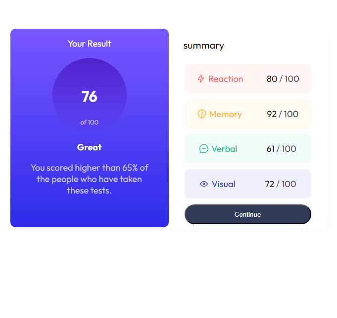

# results-summary-component
A challenge for frontend mentor
# Frontend Mentor - Results summary component solution

This is a solution to the [Results summary component challenge on Frontend Mentor](https://www.frontendmentor.io/challenges/results-summary-component-CE_K6s0maV).  

## Table of contents

- [Overview](#overview)
  - [Screenshot](#screenshot)
  - [Links](#links)
- [My process](#my-process)
  - [Built with](#built-with)
  - [What I learned](#what-i-learned)
  - [Useful resources](#useful-resources)
- [Author](#author)

**Note: Delete this note and update the table of contents based on what sections you keep.**

## Overview

### Screenshot

### Links

- Live Site URL: [Add live site URL here](https://your-live-site-url.com)

## My process

### Built with

- HTML5
- CSS 
- Flexbox
- Mobile-first workflow

### What I learned
 -flex-box

 -media query

 -hover and action

### Useful resources

- [resource 1]((https://unclebigbay.com/5-steps-to-live-preview-your-web-project-on-mobile-devices)) - This helped me to preview my project on my phone.
- [resource 2]((https://www.w3schools.com/cssref/func_linear-gradient.php)) - This helped me to make results background.

## Author

- linkedin - [saina soltani](https://www.linkedin.com/in/saina-soltani-a9273a1b5/?originalSubdomain=ir)

